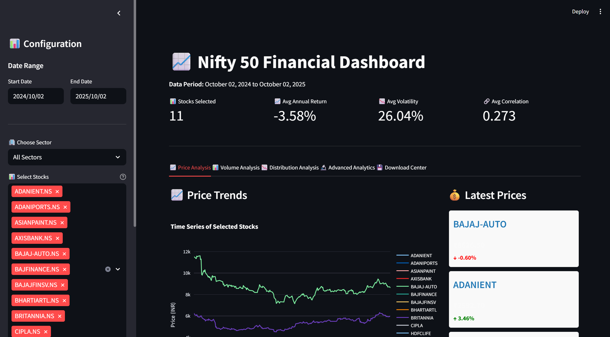
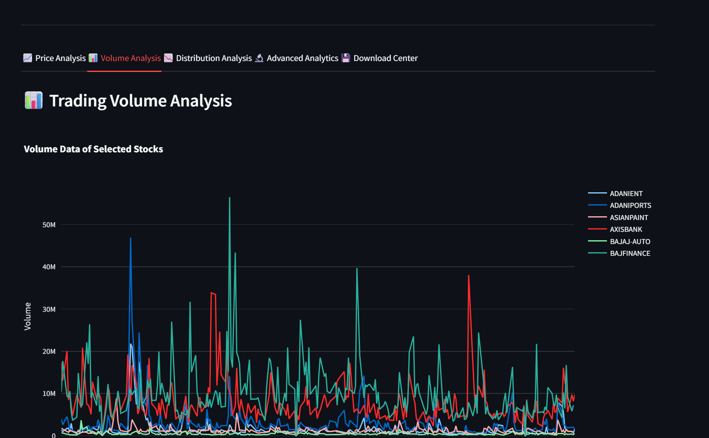
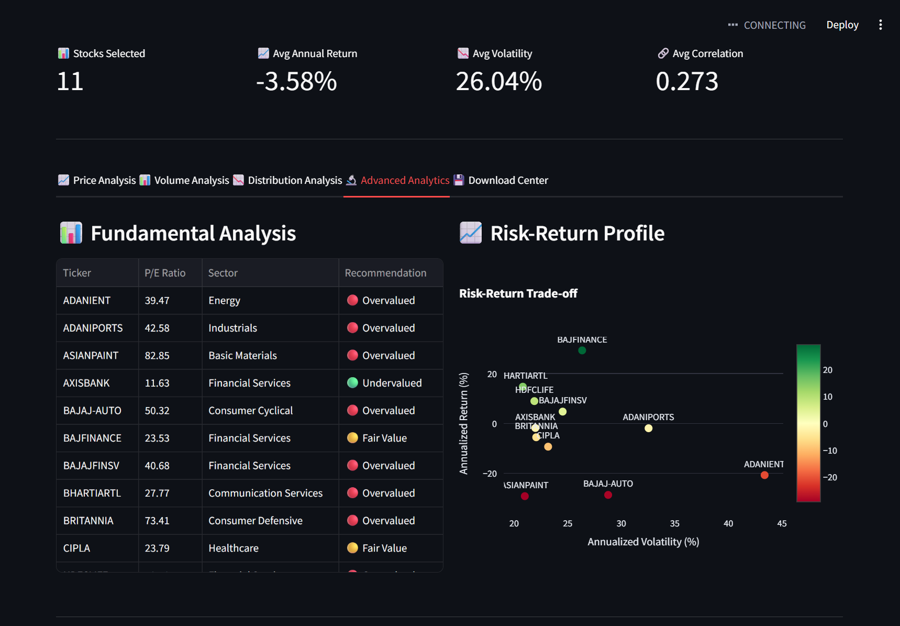
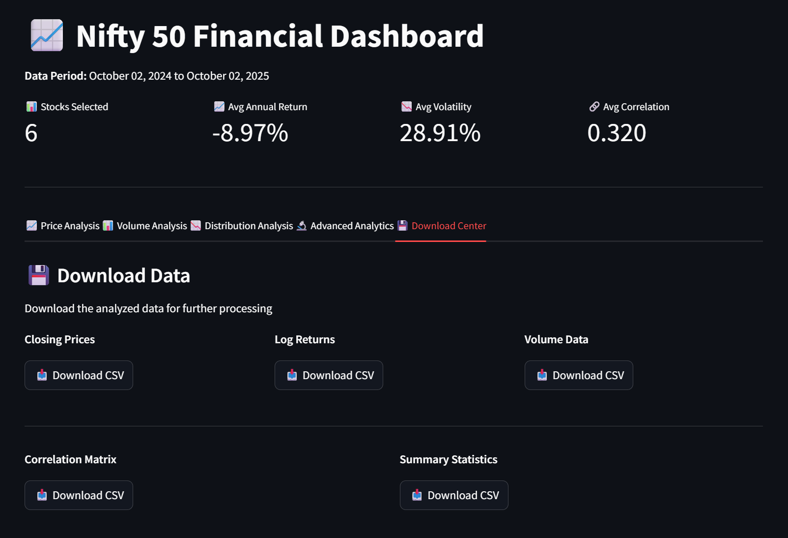

# 📊 Nifty 50 Financial Dashboard

<div align="center">


**A comprehensive, interactive web dashboard for analyzing Nifty 50 stocks with advanced statistical analytics and machine learning capabilities.**

### Main Dashboard

</div>

---

## 🎯 Overview

The Nifty 50 Financial Dashboard is a powerful, real-time stock analysis tool built with Python and Streamlit. It provides institutional-grade analytics for India's top 50 stocks, including price trends, volume analysis, correlation matrices, risk-return profiles, and machine learning-based clustering.

### 🎪 Key Highlights

- 📈 **Real-time Data**: Fetches live stock data from Yahoo Finance
- 🔍 **Advanced Analytics**: Correlation analysis, MDS visualization, KMeans clustering
- 📊 **Interactive Visualizations**: Built with Plotly and Matplotlib for professional charts
- 🎯 **Sector Analysis**: Filter and analyze stocks by industry sectors
- 💾 **Data Export**: Download all analysis results in CSV format
- 🎨 **Modern UI**: Clean, responsive interface with dark mode support

---

## ✨ Features

### 📈 Price Analysis
- **Time Series Visualization**: Interactive price charts with zoom and pan
- **Cumulative Returns**: Track investment performance over time
- **Daily Changes**: Real-time price movements with color-coded indicators
- **Custom Date Ranges**: Analyze any historical period

### 📊 Volume Analysis
- **Trading Volume Trends**: Identify liquidity patterns
- **Volume Comparison**: Compare average volumes across stocks
- **Liquidity Metrics**: Assess market depth and trading activity

### 📉 Distribution Analysis
- **Log Returns Distribution**: Compare empirical vs normal distribution
- **Statistical Metrics**: Mean, standard deviation, skewness, kurtosis
- **Autocorrelation Plots**: Identify patterns and dependencies
- **Normality Testing**: Visual assessment of return distributions

### 🔬 Advanced Analytics
- **Correlation Matrix**: Identify co-movement between stocks
- **Distance Matrix**: Measure similarity using Euclidean distance
- **MDS Visualization**: 2D projection of stock relationships
- **KMeans Clustering**: Group similar stocks using machine learning
- **Risk-Return Profile**: Scatter plot of annualized returns vs volatility
- **Fundamental Analysis**: P/E ratios with buy/hold/sell recommendations

### 💾 Data Export
- Closing prices (CSV)
- Log returns (CSV)
- Volume data (CSV)
- Correlation matrix (CSV)
- Summary statistics (CSV)

---

## 🚀 Installation

### Prerequisites

- Python 3.8 or higher
- pip (Python package manager)
- Internet connection (for fetching stock data)

### Step 1: Clone the Repository

```bash
git clone https://github.com/chetannihith/python-hacktoberfest25.git
cd Nifty50_Dashboard
```

### Step 2: Create Virtual Environment (Recommended)

```bash
# Windows
python -m venv venv
venv\Scripts\activate

# macOS/Linux
python3 -m venv venv
source venv/bin/activate
```

### Step 3: Install Dependencies

```bash
pip install -r requirements.txt
```

### Step 4: Run the Dashboard

```bash
streamlit run Dashboard.py
```

The dashboard will automatically open in your default web browser at `http://localhost:8501`

---

## 📦 Dependencies

Create a `requirements.txt` file with the following:

```txt
streamlit>=1.28.0
yfinance>=0.2.28
pandas>=2.0.0
numpy>=1.24.0
matplotlib>=3.7.0
seaborn>=0.12.0
plotly>=5.14.0
scipy>=1.10.0
scikit-learn>=1.3.0
statsmodels>=0.14.0
```

---

## 💻 Usage

### Basic Usage

1. **Launch the Dashboard**
   ```bash
   streamlit run Dashboard.py
   ```

2. **Select Date Range**
   - Use the sidebar calendar to choose start and end dates
   - Default: Last 1 year of data

3. **Filter by Sector**
   - Choose "All Sectors" or specific sector (e.g., IT, Banking)
   - Select individual stocks from the filtered list

4. **Explore Tabs**
   - Navigate through 5 comprehensive analysis tabs
   - Enable/disable advanced visualizations from sidebar

### Advanced Features

#### 🎯 Sector Analysis
```python
# Select sector from dropdown
Sector: Banking → Shows only banking stocks
         IT → Shows only IT stocks
         All Sectors → Shows all 47 stocks
```

#### 🔬 Machine Learning Clustering
```python
# Enable KMeans Clustering
☑ Show KMeans Clustering
Clusters: 4  # Adjust slider for optimal k

# Results: Stocks grouped by similar behavior
```

#### 📊 Correlation Analysis
```python
# Enable Correlation Matrix
☑ Show Correlation Matrix

# Interpretation:
# Red (1.0): Perfect positive correlation
# Blue (-1.0): Perfect negative correlation
# White (0.0): No correlation
```

---

## 📸 Screenshots

### Main Dashboard


### Volume Analysis Tab


### Advanced Analytics


### Download Center


---

## 🏗️ Project Structure

```
nifty50-dashboard/
│
├── Dashboard.py              # Main application file
├── requirements.txt          # Python dependencies
├── README.md                # This file
│
├── assets/                  # Images
│   └── images

```

---

## 🎓 Understanding the Analytics

### Log Returns
```python
Log Return = ln(Price_today / Price_yesterday)
```
- More statistically sound than simple returns
- Additive over time (easier to aggregate)
- Approximately normal for short periods

### Correlation Matrix
- **Range**: -1 to +1
- **+1**: Perfect positive correlation (move together)
- **-1**: Perfect negative correlation (move opposite)
- **0**: No linear relationship

### Risk-Return Profile
- **X-axis**: Annualized Volatility (Risk)
- **Y-axis**: Annualized Return (Reward)
- **Optimal**: High return, low volatility (top-left)

### KMeans Clustering
- Groups stocks with similar price behavior
- Uses Euclidean distance in return space
- Useful for portfolio diversification

---

## 🔧 Configuration

### Modify Stock List

Edit the `tickers` list in `Dashboard.py`:

```python
tickers = [
    "ADANIENT.NS", "ADANIPORTS.NS", "ASIANPAINT.NS",
    # Add or remove stocks here
    "YOUR_STOCK.NS"
]
```

### Adjust Cache Duration

Modify the cache TTL (time-to-live):

```python
@st.cache_data(ttl=86400)  # 24 hours in seconds
# ttl=3600  # 1 hour
# ttl=21600  # 6 hours
```

### Customize Visualizations

Change color schemes in `Dashboard.py`:

```python
# Correlation heatmap
sns.heatmap(corr_matrix, cmap="coolwarm")  # Try: 'viridis', 'RdBu', 'YlOrRd'

# Plotly charts
fig.update_layout(template="plotly_dark")  # Try: 'plotly_white', 'seaborn'
```

---

## 🐛 Troubleshooting

### Issue: "Failed to load data"
**Solution**: Check your internet connection. Yahoo Finance API requires active internet.

### Issue: "Ticker not found"
**Solution**: Some stocks may be delisted. Remove them from the `tickers` list.

### Issue: Slow loading times
**Solution**:
- Reduce the number of selected stocks
- Shorten the date range
- Clear Streamlit cache: `streamlit cache clear`

### Issue: Module not found
**Solution**: Reinstall dependencies:
```bash
pip install -r requirements.txt --force-reinstall
```

### Issue: FutureWarning about auto_adjust
**Solution**: Already handled! The code explicitly sets `auto_adjust=False`

---

## 🚀 Performance Optimization

### Caching Strategy
- **Data caching**: 24-hour TTL for price data
- **Volume data**: Cached per ticker to avoid redundant API calls
- **Clear cache**: Settings → Clear Cache

### Resource Management
- Matplotlib figures are explicitly closed after rendering
- Large dataframes filtered before processing
- Progress bars for long-running operations

---

## 📊 Data Sources

- **Primary**: [Yahoo Finance](https://finance.yahoo.com/) via `yfinance` API
- **Index**: NSE (National Stock Exchange of India)
- **Update Frequency**: Real-time with 15-20 minute delay
- **Historical Data**: Available from stock listing date

---

## 🙏 Acknowledgments

- **yfinance**: For providing easy access to Yahoo Finance data
- **Streamlit**: For the amazing web framework
- **Plotly**: For interactive visualizations
- **scikit-learn**: For machine learning algorithms
- **NSE India**: For Nifty 50 index composition

---
## ⚠️ Disclaimer

**IMPORTANT**: This dashboard is for educational and informational purposes only.

- **Not Financial Advice**: Do not use this tool as the sole basis for investment decisions
- **No Warranty**: The software is provided "as is" without warranty of any kind
- **Data Accuracy**: While we strive for accuracy, we cannot guarantee real-time accuracy
- **Risk Warning**: Stock market investments carry risk. Past performance does not guarantee future results
- **Consult Professionals**: Always consult with qualified financial advisors before investing

**By using this software, you agree that the authors and contributors are not liable for any financial losses incurred.**

---

## 📚 Additional Resources

### Learning Resources
- [Streamlit Documentation](https://docs.streamlit.io/)
- [yfinance Documentation](https://pypi.org/project/yfinance/)
- [Pandas User Guide](https://pandas.pydata.org/docs/user_guide/index.html)
- [Portfolio Theory](https://www.investopedia.com/terms/m/modernportfoliotheory.asp)

---
